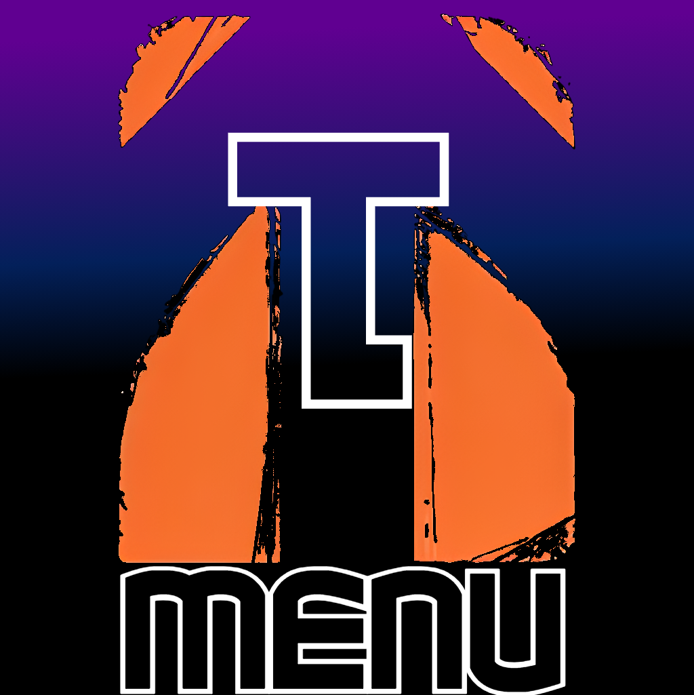

<p align="center">
  
</p>

<h1 align="center">TMenu</h1>

<p align="center">
  A real-time memory (RTM) tool for <strong>Skate 3</strong> on PS3, built for use with webMAN-MOD's PS3MAPI.
</p>

---

## What is this?

TMenu connects to a PS3 running [webMAN-MOD](https://github.com/aldostools/webMAN-MOD) over your local network and reads/writes Skate 3's memory live while the game is running. It's a from-scratch Python + Qt rebuild of a set of older, separate Skate 3 tools as well as new findings, brought together into one app with a single connection.

## Requirements

- A PS3 running [webMAN-MOD](https://github.com/aldostools/webMAN-MOD) with PS3MAPI enabled, on the same network as your PC
- A copy of Skate 3 running on that PS3
- Windows, if you're using the prebuilt `TMenu.exe`
- Python 3.10+, if you're running from source

## Getting started

1. Boot Skate 3 on your PS3, with webMAN-MOD's PS3MAPI enabled.
2. Open TMenu on your PC (same network as the PS3).
3. On the **CONNECTION** tab, type in your PS3's IP address and hit **CONNECT**. This connects to the PS3 and attaches to the running game in one step — if Skate 3 isn't running yet, it'll tell you to boot it first, but the connection itself stays up so you can just hit CONNECT again once it is.
4. Once attached, use any of the tabs below — most fields have a **GET** button to read the current value and a **SET**/toggle button to write it back.

## Tabs

- **Connection** — connect to your PS3's IP and attach to the running game
- **Edit Skater** — per-skater (1–5) editing: RGB colors, RGB swapping, body/face sliders, stance/style/posture, clothing recipes (including importing straight from a `skater.p` save), an **Assets** editor, clothing lock, graphics, invisible parts, gender, team & player names
- **Toggleables** — on-board, off-board, environment, and misc gameplay toggles
- **Adjustables** — global values like ollie height, jump height, and plant height
- **Visuals** — transparency, field of view, fog color/density/distance, HUD score multiplier, exposure, and more
- **Park** — edit the RGB grid for custom park pieces, editor border controls, and (**Open World** subtab) Park Editor / Object Dropper / Park Saving for free-roam
- **Online** — challenge editing, server options, online toggleables, and a teleporter
- **Save** — difficulty and stats editing
- **Misc** — debug camera and animation debug
- **Binds** — assign system-wide keyboard hotkeys to almost any toggle or value in the app, so they work even while the game window has focus
- **Settings** — theming (with your own `theme.json`), config export/import, reset everything to defaults, and restart

Most tabs also have an **export/import**, so you can save your setup (a config, a skater recipe, your binds, a theme) to a file and load it again later — these save into their own folder next to the app (`config/`, `recipes/`, `assets/`, `binds/`, `theme/`) the first time you use them.

## Edit Skater: Recipes and Assets

**Recipes subtab**
- **Export** saves the selected skater's recipe to a `.recipe` file. Trailing zero padding is trimmed (one `00` is kept on the end), so exports are only as big as the recipe really is.
- **Import** takes either a `.recipe` file or a **`skater.p`** save file (the file picker only shows `.recipe` and `.p`).
  - Picking a `skater.p` reads out the skaters stored in the save (1 to 5, depending on the save) and **exports them for you** to `recipes/saves/<save name>_<date_time>/skater_1.recipe`, `skater_2.recipe`, and so on. This works even when you're not connected to the PS3.
  - A small window then lets you **import one save skater into any slot (Skater 1-5)**, or **import all of them in one go** (save skater 1 → slot 1, 2 → 2, …).
  - Each recipe is checked before it's offered, so a damaged or unreadable entry is skipped instead of being written to the game.

**Assets subtab** — a live editor for the pieces (hat, shirt, shoes, board, …) a skater's recipe is made of:
- **Refresh current assets**, then pick one asset (or **All**) from the dropdown.
- **Remove Asset** — removes the selected asset. A skater must always keep at least one.
- **Apply Low Poly** — swaps the main model for the low-poly one. **Fix Crash** — removes the low-poly model from every asset.
- **Add Saved Asset** — adds an asset you saved earlier from this skater or another one.
- **Save Current Asset** — saves the selected asset (by name) into the `assets/` folder as a `.json` file you can keep or share.
- **Asset RGB Editor** — **GET** reads an asset's color, **SET** writes it (to one asset or All), and **PICK COLOR** opens the color picker. Assets that have no color yet get one added.

Every asset edit reads the recipe fresh from the game, changes only the bytes it needs to, writes it back, and reads it again to confirm.

## Running from source

```
pip install -r requirements.txt
python app.py
```

## Building your own TMenu.exe

Building a `.exe` has to be done on Windows (PyInstaller can't cross-compile).

1. Install Python 3.10+ on Windows ([python.org](https://www.python.org), tick "Add to PATH" during install).
2. Copy this folder onto your Windows machine.
3. Run **`build.bat`**. It'll ask for a version number — type one (e.g. `15.2.0`) or press Enter to reuse the last one used.
4. When it finishes, everything you need is in the new **`dist/`** folder: `TMenu.exe` plus `settings.json`, `theme.json`, `challenge_keys.json`, and `challenge_types.json` — keep those JSON files next to the exe, since the app reads/writes them at runtime.

## Disclaimer

This project is unofficial and unaffiliated with EA/Black Box, Sony, or Skate 3's developers. Using it while online can cause desync issues between you and other players. Do not abuse this!
